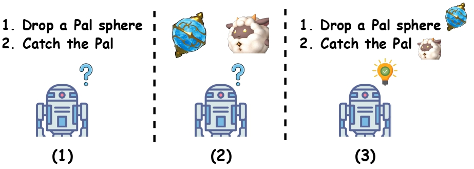

# Read to Play (R2-Play)

## Overview
Official codebase for Read to Play (R2-Play): Decision Transformer with Multimodal Game Instruction. This paper explores multimodal guidance for agents enabling them to comprehend gameplay instructions, thereby facilitating a “read-to-play” capability.

Creating a generalist agent that can accomplish diverse tasks is an enduring goal in artificial intelligence. The recent advancement in integrating textual guidance or visual trajectory into a single decision-making agent presents a potential solution. This line of research provides task-specific context to guide the agent. Although textual guidance and visual trajectory each offer advantages, they also have distinct limitations: (1) Textual guidance lacks visually-grounded information, which diminishes its expressiveness for decision-making tasks based on visual observations; (2) Without clear task instructions, deriving an effective strategy from a visual trajectory is extremely difficult, which is similar to people's difficulty understanding player intentions when watching game videos without explanations. The complementary relationship between textual guidance and visual trajectory suggests their combination enhances guidance effectiveness, as illustrated in Figure 1. As a result, this paper aims to develop an agent capable of adapting to new tasks through multimodal guidance.

<div align=center></div>
<center><b><font size ='1'>Figure1: Imagine an agent learning to play Palworld (a Pok\'emon-like game). (1) The agent exhibits confusion when only relying on textual guidance. (2) The agent is confused when presented with images of a Pal sphere and a Pal. (3) The agent understands how to catch a pet through multimodal guidance, which combines textual guidance with images of the Pal sphere and Pal.</font></b></center></font>

## Install Dependencies
Dependencies can be installed with the following command:
```
conda env create -f env.yml
```

## Download Offline Datasets
Download the dataset and place it in the data/dataset.
```
gsutil -m cp -R gs://atari-replay-datasets/dqn/[GAME_NAME] [DIRECTORY_NAME]
```

## Game Instruction Set
The Game Instruction Set comprises the following components stored in the designated directories:
* Game Description (stored in data/instruction/raw/desc)
* Game Trajectory (stored in data/instruction/raw/traj)
* Game Guidance (stored in data/instruction/raw/guid)
```
# a example of Game Guidance
"1": {
  "action": "[noop]",
  "guidance": "noop",
  "elements": {
  "ball": [
    [
    42,
    323
    ],
    [
    51,
    333
    ]
  ],
  "paddle": [
    [
    33,
    463
    ],
    [
    102,
    472
    ]
  ]
  }
}
```

## Train
The training configuration is available at config/config_main/train.yaml.
```
sh offline/run.sh 
```

## Download Weights
We provide model weights trained on large-scale offline datasets of ~4M(100k × 37) and ~8M(200k × 37) respectively:
  * [4M](https://drive.google.com/file/d/1va6rVOgmnIfqpOX4xxLW1IyiEeCuR6l2/view?usp=drive_link)
  * [8M](https://drive.google.com/file/d/12NaAWil_0GAfiFWCTMAA77JC1UE2gywH/view?usp=drive_link)


## Evaluation 
The evaluation configuration is available at config/config_main/eval.yaml.
```
sh eval/run.sh
```

## Citation
```
@article{Jin2024,
  title={Read to Play (R2-Play): Decision Transformer with Multimodal Game Instruction},
  author={Yonggang Jin, Ge Zhang, Hao Zhao, Tianyu Zheng, Jiawei Guo, Liuyu Xiang, Shawn Yue, Stephen W. Huang, Wenhu Chen, Zhaofeng He, Jie Fu},
  journal={arXiv preprint arXiv:2402.04154},
  year={2024}
}
```
